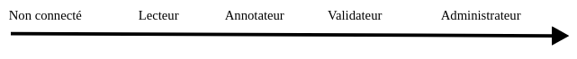

Roles
=====

Lorsque votre inscription est finalisée, un rôle pourra vous être attribué afin de permettre à notre base de données de se développer et vous pourrez aussi échanger avec les autres membres grâce à notre forum. Ce rôle vous sera attribué en fonction de vos connaissances biologiques mais surtout de votre implication.

Il existe 4 rôles différents : 

Lecteur
-------

Le rôle de lecteur permet comme une personne non connectée d’avoir accès aux formulaires pour la recherche de génomes ou de protéines/CDS. 

Annotateur
----------

Le rôle d’annotateur permet d’annoter/ de compléter les informations sur les protéines ou les CDS. 

L’annotateur peut accéder à une page supplémentaire qui lui permet de visualiser toutes les protéines/CDS qu’il peut annoter. Si ce rôle vous a été attribué, vous pouvez cliquer sur l’identifiant dont vous voulez modifier les informations. 
Vous accédez à la page “annotation des informations relatives aux gènes” qui vous permet d’entrer les annotations que vous souhaitez soumettre à la validation. 
Sur cette page vous pouvez aussi blaster les séquences protéiques et nucléotidiques. 

Sur la page d’informations relatives aux protéines ou CDS, il y a un raccourci vers la page d’annotation de cette protéine/CDS si cette dernière a été affectée à l’annotateur en question.

Validateur
----------

Le rôle de validateur permet d’affecter des annotations à des annotateurs et de les valider ou non. L’utilisateur qui est validateur est aussi annotateur, il peut donc aussi annoté des protéines/CDS. 

La page de validation permet l’accès à différentes pages : Valider des annotations, Affecter des annotations (déjà affectées, à affecter).

Lorsque l’utilisateur accède à la page “Valider des annotations”, on lui présente les séquences n’ayant pas encore été annotées (en attente) et les séquences ayant des annotations en attente de validation. 
Le bouton “View” pour les annotations à valider permet de voir les modifications qui ont été faites par l’annotateur et le validateur peut ensuite les valider ou non. 

La page “Déjà Affectées” présente des toggle listes des annotateurs dans lesquelles se trouvent la liste des séquences qui lui sont affectées. 

La page “À affecter” permet d’affecter un annotateur à une protéine afin qu’il puisse l’annoter. Le validateur doit entrer l’identifiant de la protéine ou CDS qu’il veut attribuer. Cela l’envoie sur une page où il peut sélectionner l’annotateur grâce à une liste déroulante qu’il veut pour l’annotation. Cette page est aussi accessible depuis la page des informations relatives aux protéines ou CDS. 
Lorsque le validateur a validé son choix d’annotateur pour un certain identifiant, il est basculé vers la page “Valider des annotations”.

Administrateur
--------------

L’utilisateur qui est administrateur est aussi validateur et annotateur. 
L’administrateur a accès à la liste de tous les utilisateurs avec la date et heure de leur dernière connexion et leur rôle. Il peut créer et supprimer des utilisateurs. Il peut également changer le rôle d’un utilisateur.
